<!--
  ╔══════════════════════════════════════════════════════════════╗
  ║                                                              ║
  ║   ABHIRAG S V — GitHub Profile README                       ║
  ║   Theme: Crimson Terminal // v2.0                            ║
  ║                                                              ║
  ║   SETUP:                                                     ║
  ║   1. Create repo "Abhirag05/Abhirag05"                      ║
  ║   2. Copy all files (assets/, .github/, README.md)          ║
  ║   3. Push & trigger the snake workflow from Actions tab     ║
  ║                                                              ║
  ╚══════════════════════════════════════════════════════════════╝
-->

  <!-- ANIMATED HEADER BANNER -->
  

    

  <!-- TYPING ANIMATION -->
  

    

  <!-- SOCIAL BADGES -->
  
  &nbsp;
  
  &nbsp;
  
  &nbsp;
  
  &nbsp;
  
    
  

 

<!-- ═══════════════════ DIVIDER ═══════════════════ -->

 

<!-- ═══════════════════ ABOUT ME TERMINAL ═══════════════════ -->

  

 

<!-- ═══════════════════ DIVIDER ═══════════════════ -->

 

<!-- ═══════════════════ TECH ARSENAL ═══════════════════ -->

<h2 align="center">
  <samp>⟨TECH ARSENAL ⟩</samp>
</h2>

<h4><samp>◆ LANGUAGES</samp></h4>

<h4><samp>◆ FRONTEND</samp></h4>

<h4><samp>◆ BACKEND &amp; DATABASE</samp></h4>

<h4><samp>◆ TOOLS &amp; PLATFORMS</samp></h4>

 

<!-- ═══════════════════ DIVIDER ═══════════════════ -->

 

<!-- ═══════════════════ GITHUB ANALYTICS ═══════════════════ -->

<h2 align="center">
  <samp>⟨ GITHUB ANALYTICS ⟩</samp>
</h2>

  <!-- Stats card — generated by GitHub Actions (assets/github-stats.svg) -->
  
  &nbsp;
  

 

  <!-- Streak card -->
  

 

  

 

<!-- ═══════════════════ DIVIDER ═══════════════════ -->

 

 

<!-- ═══════════════════ CONTRIBUTION SNAKE ═══════════════════ -->

<h2 align="center">
  <samp>⟨ CONTRIBUTIONS⟩</samp>
</h2>

  <picture>
    <source media="(prefers-color-scheme: dark)" srcset="https://raw.githubusercontent.com/Abhirag05/Abhirag05/output/snake-dark.svg" />
    <source media="(prefers-color-scheme: light)" srcset="https://raw.githubusercontent.com/Abhirag05/Abhirag05/output/snake-dark.svg" />
    
  </picture>

   
 

 

<!-- ═══════════════════ DIVIDER ═══════════════════ -->

 

<!-- ═══════════════════ FOOTER ═══════════════════ -->

  

 

  <samp>
    <b>Wanna talk? Drop a mail or connect on LinkedIn.</b>
      
    
  </samp>

